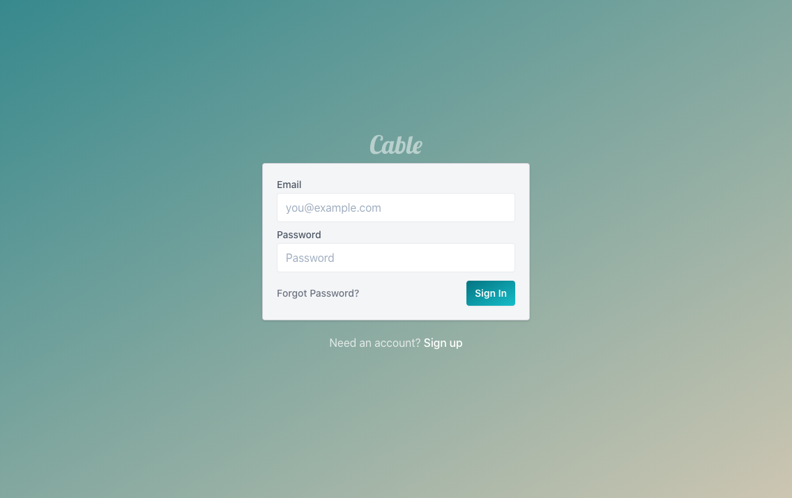

# Cable

A Laravel Livewire authentication preset. As in, a bundle of wires. 🚠

**This is meant to be used for new projects, not existing ones.**



## Requirements

-   Laravel 8+
-   PHP 7.4+

## Installation

To install the preset, simply require it via composer, and run the command.

```sh
composer require austencam/cable
php artisan cable:run
```

If you're really crazy, you can use add this alias to your `.zshrc` or `.bashrc` file:

```sh
function newapp() {
    composer create-project --prefer-dist laravel/laravel ${1:-newapp}
    cd ${1:-newapp}
    composer require austencam/cable
    php artisan cable:run
    cp .env.example .env
    php artisan key:generate
}
```

Then you can run `newapp your-app-name` to start a fresh laravel project with the preset.

## Features

-   Removes minified `.js` and `.css` files from version control
-   Boilerplate configured for Tailwind `1.x`, Alpine `2.x`, and Livewire `2.x`
-   Blade components for `app` and `auth` layouts
-   Livewire components
    -   Login & Logout
    -   Register
    -   Forgot Password (via email)
    -   Profile
-   Blade components
    -   `<x-input>`
    -   `<x-card>`
    -   `<x-logo>`
    -   `<x-button>`
    -   `<x-inline-flash>`
-   Tests included for all Livewire components

## Contributing

Find a bug? Have a feature suggestion? This project is open for contribution of ideas and bugfixes -- [create an issue](https://github.com/austenc/cable/issues/new)!
